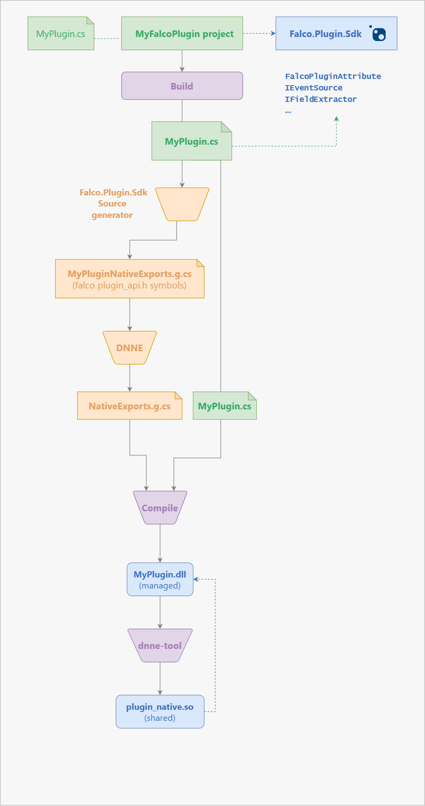

# Falco.Plugin.Sdk

Unofficial **prototype** .NET Falco plugin SDK, powered by DNNE native exports

> ✨ Early development stage alert 

# What is working right now
  - init, destroy
  - plugin info symbols (get_name, get_id, get_contact, get_decription, ...)
  - get_open_params

# Sample DummyPlugin deployment
### Plugin.cs
```cs
using System;
using System.Collections.Generic;
using Falco.Plugin.Sdk;

namespace Falco.Plugin.Sdk
{
    [FalcoPlugin(
      Id = 42,
      Name = "DummyPlugin",
      Description = "A dummy plugin",
      Contacts = "mvenditto",
      RequiredApiVersion = "2.0.0",
      Version = "1.0.0")]
    public class Plugin : IEventSource
    {
        public string EventSourceName => "dummy_source";

        public IList<string> EventSourcesToConsume => new List<string> 
        { 
            "some_source_1",
            "some_source_2"
        };

        public IList<OpenParam> OpenParameters => new List<OpenParam>
        {
            new(value: "resource1", desc: "An example of openable resource"),
            new(value: "resource2", desc: "Another example of openable resource"),
            new(value: "res1;res2;res3", desc: "Some names", separator: ";"),
        };
    }
}
```

### build.sh
```bash
dotnet build Falco.Plugin.Sdk.Generators.csproj --configuration Release --runtime linux-x64 --no-self-contained
dotnet build Falco.Plugin.Sdk.DummyPlugin/Falco.Plugin.Sdk.DummyPlugin.csproj --configuration Release --runtime linux-x64 --no-self-contained
cp Falco.Plugin.Sdk.DummyPlugin/bin/Release/net6.0/linux-x64/Falco.Plugin.Sdk.dll /usr/share/falco/plugins/dummy_plugin
cp Falco.Plugin.Sdk.DummyPlugin/bin/Release/net6.0/linux-x64/Falco.Plugin.Sdk.DummyPlugin.dll /usr/share/falco/plugins/dummy_plugin
cp Falco.Plugin.Sdk.DummyPlugin/bin/Release/net6.0/linux-x64/plugin_native.so /usr/share/falco/plugins/dummy_plugin
cp Falco.Plugin.Sdk.DummyPlugin/bin/Release/net6.0/linux-x64/Falco.Plugin.Sdk.DummyPlugin.runtimeconfig.json /usr/share/falco/plugins/dummy_plugin
```

### falco.yml
```yaml
plugins:
  - name: dummy_plugin
    library_path: my_plugin/plugin_native.so
load_plugins: [dummy_plugin]
```
### Test
<pre><samp>admin@someplace:~$ <kbd>tree /usr/share/falco</kbd>
/usr/share/falco/
└── plugins
    ├── libjson.so
    ├── libk8saudit.so
    └── dummy_plugin
        ├── Falco.Plugin.Sdk.dll
        ├── plugin_native.so
        ├── Falco.Plugin.Sdk.DummyPlugin.dll
        └── Falco.Plugin.Sdk.DummyPlugin.runtimeconfig.json</samp>
        
<samp>admin@someplace:~$ <kbd>nm -gD /usr/share/falco/plugins/dummy_plugin/plugin_native.so | grep plugin_</kbd>
0000000000003c70 T plugin_close
0000000000003aa0 T plugin_destroy
0000000000003d40 T plugin_event_to_string
0000000000003de0 T plugin_extract_fields
0000000000003b60 T plugin_get_contact
0000000000003b30 T plugin_get_description
0000000000003bf0 T plugin_get_event_source
0000000000003bc0 T plugin_get_id
0000000000003a30 T plugin_get_init_schema
0000000000003ad0 T plugin_get_last_error
0000000000003b00 T plugin_get_name
0000000000003cf0 T plugin_get_progress
0000000000003a00 T plugin_get_required_api_version
0000000000003b90 T plugin_get_version
0000000000003a60 T plugin_init
0000000000003cb0 T plugin_list_open_params
0000000000003d80 T plugin_next_batch
0000000000003c20 T plugin_open</samp>

<samp>admin@someplace:~$ <kbd>falco --plugin-info dummy_plugin</kbd>
Tue Nov  1 21:53:20 2022: Falco version: 0.33.0 (x86_64)
Tue Nov  1 21:53:20 2022: CLI args: falco --plugin-info dummy_plugin
Tue Nov  1 21:53:20 2022: Falco initialized with configuration file: /etc/falco/falco.yaml
Name: DummyPlugin
Description: A dummy plugin
Contact: mvenditto
Version: 1.0.0
Capabilities:
  - Event Sourcing (ID=42, source='dummy_source')

Init config schema type: Not available, plugin does not implement the init config schema functionality


Suggested open params:
resource1: An example of openable resource
resource2: Another example of openable resource
res1;res2;res3: Some names

admin@someplace:~$ █</samp></pre>

## Native plugin build pipeline


